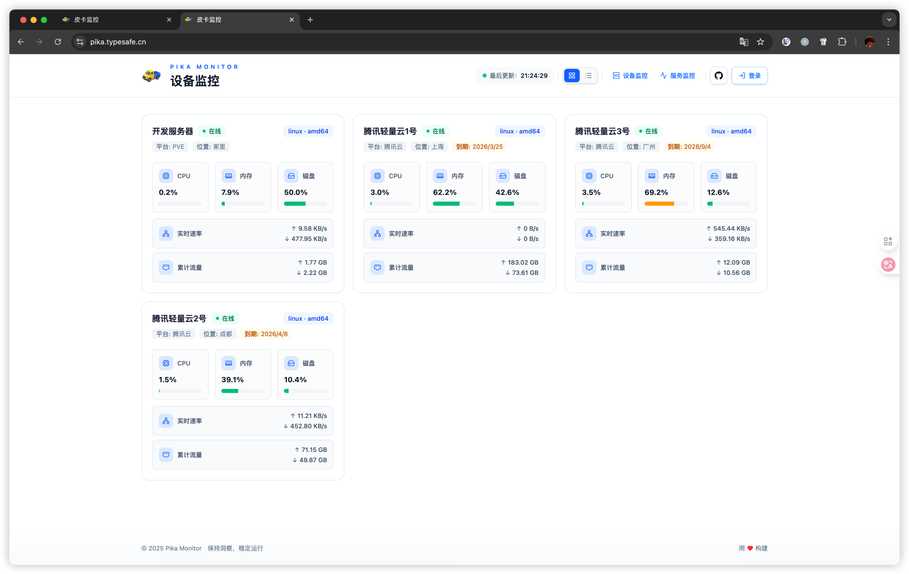
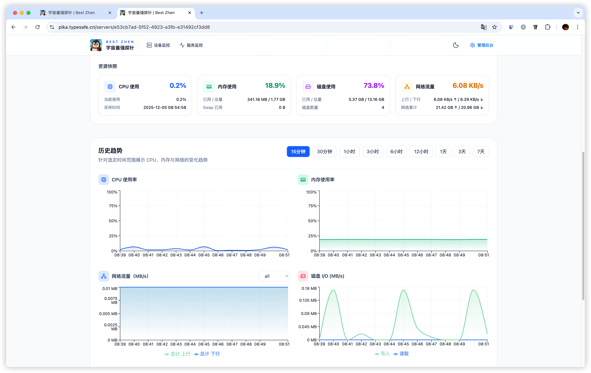
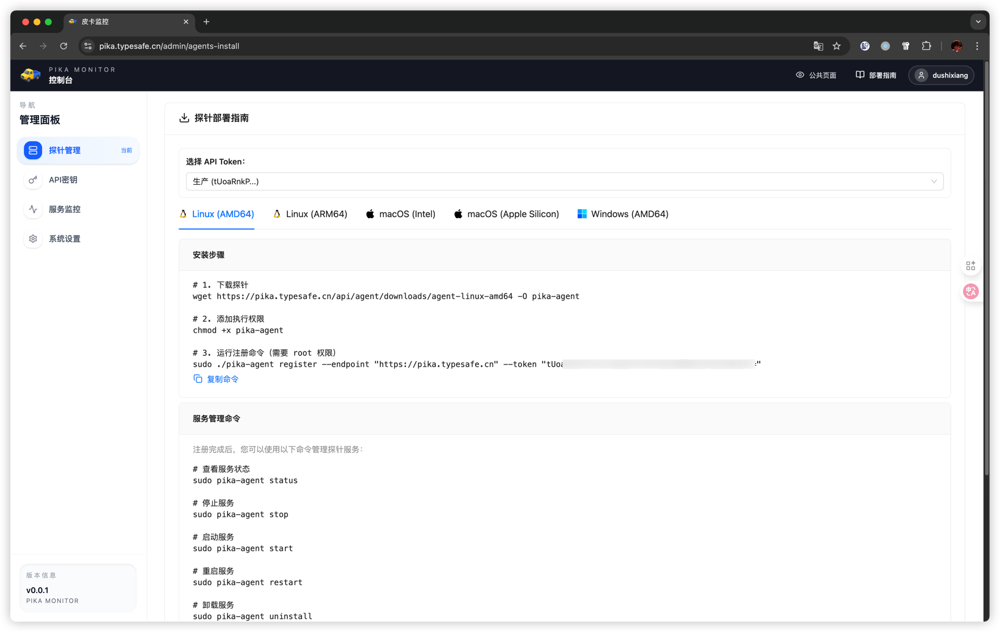

# Pika 探针监控系统

<div align="center">

一个基于 Go + PostgreSQL 的实时探针监控系统

[快速开始](#快速开始) • [功能特性](#功能特性) • [文档](#文档) • [架构](#架构)

</div>

## 简介

Pika 是一个轻量级的探针监控系统，支持实时数据采集、存储和查询。系统采用 WebSocket 进行探针与服务端的通信，使用 PostgreSQL 存储时序数据。


## 截图





## 快速开始

### 环境要求

- Docker 20.10+
- Docker Compose 1.29+

### 一键部署

#### 1. 下载配置文件

```bash
# 下载 docker-compose.yml 配置文件
curl -O https://raw.githubusercontent.com/dushixiang/pika/main/docker-compose.yml
# 下载配置文件示例
curl -o config.yaml https://raw.githubusercontent.com/dushixiang/pika/main/config.example.yaml

# 或使用 wget
wget https://raw.githubusercontent.com/dushixiang/pika/main/docker-compose.yml
wget -O config.yaml https://raw.githubusercontent.com/dushixiang/pika/main/config.example.yaml
```

#### 2. 修改配置（重要）

编辑 `config.yaml` 文件，根据需要修改以下配置：

- **数据库配置**：确保数据库连接信息与 `docker-compose.yml` 中的 PostgreSQL 服务配置一致
  ```yaml
  Database:
    Postgres:
      Hostname: pika-postgresql  # Docker Compose 服务名
      Port: 5432
      Username: pika
      Password: pika  # 生产环境建议修改
      Database: pika
  ```

- **JWT 密钥**：必须修改为强随机字符串
  ```yaml
  App:
    JWT:
      Secret: "your-secret-key-here"  # 必须修改
  ```

  生成随机密钥：
  ```bash
  openssl rand -base64 32
  ```

- **用户认证**：配置管理员账户或启用 OIDC/GitHub 登录
  ```yaml
  App:
    # Basic Auth 用户（默认用户名: admin，密码: admin123）
    Users:
      admin: "$2y$12$7DXcOiX1D59xNTIn5riUKusAPLP88LxxoczWmUT83MBj5EFznbp8a"

    # 可选：启用 OIDC 认证
    OIDC:
      Enabled: false
      Issuer: "https://your-oidc-provider.com"
      ClientID: "your-client-id"
      ClientSecret: "your-client-secret"

    # 可选：启用 GitHub OAuth
    GitHub:
      Enabled: false
      ClientID: "your-github-client-id"
      ClientSecret: "your-github-client-secret"
  ```

- **生成新的管理员密码**：
  ```bash
  # 使用 htpasswd 工具
  htpasswd -nBC 12 '' | tr -d ':\n'
  ```

**注意**：如果修改了 `docker-compose.yml` 中的数据库密码（`POSTGRES_PASSWORD`），也需要同步修改 `config.yaml` 中的数据库密码

#### 3. 启动服务

```bash
# 启动所有服务
docker-compose up -d

# 查看服务状态
docker-compose ps

# 查看日志
docker-compose logs -f pika
```

#### 4. 访问服务

服务启动后，访问 http://localhost:8080

#### 5. 停止服务

```bash
# 停止服务
docker-compose stop

# 停止并删除容器
docker-compose down

# 停止并删除容器及数据卷
docker-compose down -v
```

### 生产环境部署建议

#### 1. 安全配置

- 修改 `docker-compose.yml` 中的默认数据库密码（`POSTGRES_PASSWORD`）
- 修改 `config.yaml` 中的数据库密码（`Database.Postgres.Password`），与 docker-compose 中的设置保持一致
- 在 `config.yaml` 中设置强随机的 JWT 密钥（`App.JWT.Secret`）
- 修改默认管理员密码或启用 OIDC/GitHub 认证
- 使用 HTTPS 反向代理（如 Nginx）
- 限制数据库端口仅允许内部访问（docker-compose.yml 中已配置为 `127.0.0.1:5432:5432`）
- 妥善保管 `config.yaml` 文件，避免泄露敏感信息

#### 2. 数据持久化

数据库数据默认存储在 `./data/postgresql` 目录，请定期备份：

```bash
# 备份数据库
docker-compose exec postgresql pg_dump -U pika pika > backup.sql

# 恢复数据库
docker-compose exec -T postgresql psql -U pika pika < backup.sql
```

#### 3. 反向代理配置（Nginx 示例）

```nginx
server {
    listen 80;
    server_name your-domain.com;

    location / {
        proxy_pass http://localhost:8080;
        proxy_set_header Host $host;
        proxy_set_header X-Real-IP $remote_addr;
        proxy_set_header X-Forwarded-For $proxy_add_x_forwarded_for;
        proxy_set_header X-Forwarded-Proto $scheme;

        # WebSocket 支持
        proxy_http_version 1.1;
        proxy_set_header Upgrade $http_upgrade;
        proxy_set_header Connection "upgrade";
    }
}
```

### 故障排查

#### 服务无法启动

```bash
# 查看详细日志
docker-compose logs -f

# 检查容器状态
docker-compose ps

# 重启服务
docker-compose restart
```

#### 数据库连接失败

- 确认 PostgreSQL 容器已启动且健康检查通过
- 检查 `config.yaml` 中的数据库配置是否正确：
  - `Hostname` 应该为 `pika-postgresql`（Docker Compose 服务名）
  - `Password` 应该与 `docker-compose.yml` 中的 `POSTGRES_PASSWORD` 一致
- 确认 `config.yaml` 文件已正确映射到容器中
- 查看数据库日志：`docker-compose logs postgresql`
- 查看应用日志：`docker-compose logs pika`

#### 配置文件问题

- 确认 `config.yaml` 文件存在于与 `docker-compose.yml` 同一目录
- 检查 `config.yaml` 文件格式是否正确（YAML 语法）
- 验证配置文件权限：`ls -l config.yaml`
- 查看容器内是否成功加载配置：
  ```bash
  docker-compose exec pika cat /app/config.yaml
  ```

#### 端口冲突

如果 8080 或 5432 端口被占用，修改 `docker-compose.yml` 中的端口映射：

```yaml
ports:
  - "8081:8080"  # 将 8080 改为其他端口
```